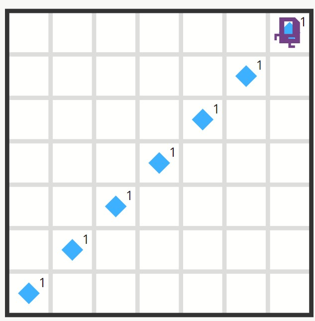

# Concepts
- While loops

# Teaching Tips
- Since students know about for loops it is a good idea to build upon for loops and deliberate with the student how to generalize loops using conditionals.

# Exercises
## Easy
### Take Karel to the End
Write a program that makes Karel move until the end of the street.

At the beginning Karel's world looks like following:

After the program, Karel's world looks like following:

## Medium
### Dence Karel
Karel loves to the dance. Today's mood? Let's do the twist. Write a program that makes Karel walk across the dance floor (hmm, aka streets) but she must do a full turn at each step.  So Karel does a spin in each round,which is turn left once and keep going until her feet are on the ground again.

Karel's world looks like the following:

## Hard
### Put Beeper and Climb
Karel tries to move to the top right corner of the world and but beepers along her way. You may assume that the worlds always have an odd number of streets and rows.*
Note that:
- Karel always begins at the bottom left corner of and empty world facing East.
- You may assume that the world is an odd number of columns across
- Karel's bag has infinite beepers.
- It does not matter which direction Karel ends up facing.
- The world is always square (the world's height is the same as its width)
*Note to tutor: you may ask the student to extend their code to work on an even numbered square world.

At the beginning Karel's world looks like following:

After the program, Karel's world looks like following:

